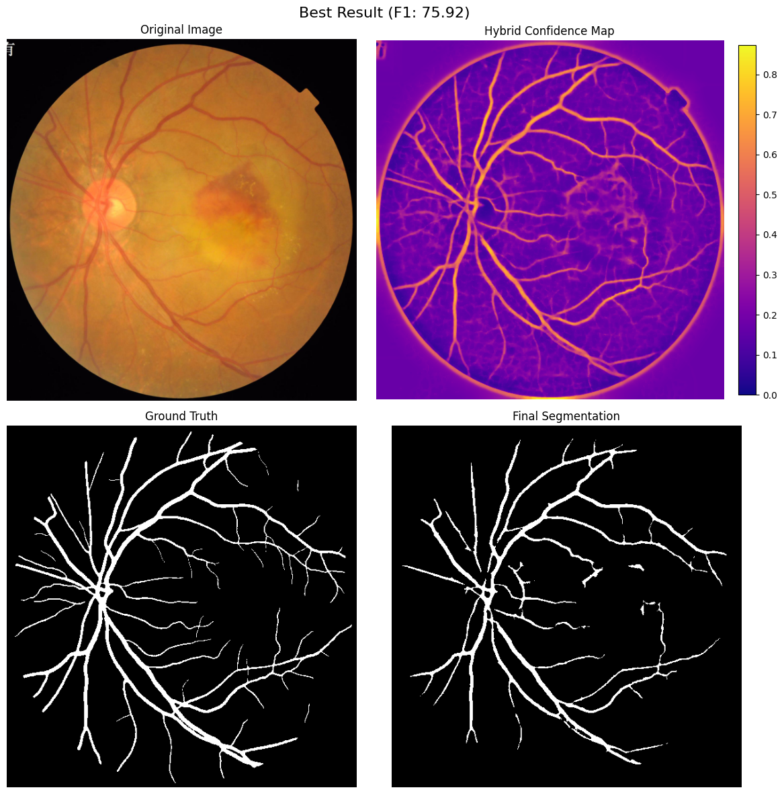

# Retinal Blood Vessel Segmentation

This project finds the blood vessels in retinal fundus images using classical image processing. We don't train any model. We run four well-known vessel detectors and blend what they find into one vessel map.

We built it for the Digital Image Processing course at IIIT Hyderabad (Dec 2025).
**Sai Sampath Ravikanti** · **Harshita Kumari**


*Top: the input fundus image and the blended confidence map. Bottom: the expert ground truth and our final segmentation.*

## Why this matters

Retinal vessels show early signs of diabetic retinopathy, glaucoma and hypertension. Tracing them by hand is slow and needs a specialist, so an automatic vessel map is a useful first step for screening.

## How it works

1. **Clean up the image.** We take the green channel, which has the best vessel contrast, and boost local contrast with CLAHE. Next we remove the bright reflex along vessels and flatten uneven lighting. Finally we invert the image so vessels appear as bright ridges.
2. **Run four detectors.** Each detector is good at something different:
   - **Matched filtering** uses Gaussian-shaped kernels and does well on medium and large vessels.
   - **Multi-scale line detection** uses rotated line kernels and catches thin vessels that the other methods miss.
   - **Scale-space (Frangi + top-hat)** uses the Hessian to measure ridge strength, which gives good precision.
   - **Morphological top-hat** works well near the bright optic disc and produces very few false positives.
3. **Blend.** Each detector outputs a confidence map from 0 to 1. We average the four maps, keep only the circular retina area, threshold the result, and remove small blobs of noise.

## Results (DRIVE dataset)

| Method | Accuracy | Sensitivity | Precision | F1 |
|---|---:|---:|---:|---:|
| Matched filtering | 86.9 % | 88.6 % | 44.4 % | 57.6 % |
| Morphological | 92.2 % | 40.9 % | 95.5 % | 57.0 % |
| Line detection | 93.2 % | 87.7 % | 66.6 % | 75.7 % |
| Scale-space | 94.7 % | 71.5 % | 83.2 % | 76.9 % |
| **Hybrid** | **94.3 %** | **76.3 %** | **83.2 %** | **76.7 %** |

Each detector on its own gives up either sensitivity or precision. The hybrid keeps a good balance of both.

## Run it

```bash
pip install opencv-python numpy scipy matplotlib jupyter
```

Put the images in `dataset/train/Original/` and the ground-truth masks in `dataset/train/Ground truth/`, then open `hybrid.ipynb` and run all cells.

| File | What it does |
|---|---|
| `preprocess.py` | Shared preprocessing steps |
| `matched.py`, `line_detection.py`, `scale_space.py`, `morphological.py` | The four detectors |
| `hybrid.ipynb` | Blending, evaluation and plots |
| `dipppt.pdf` | Project slides |
